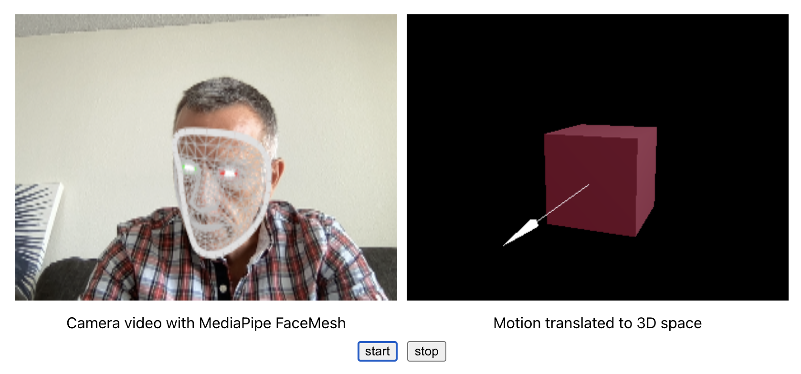
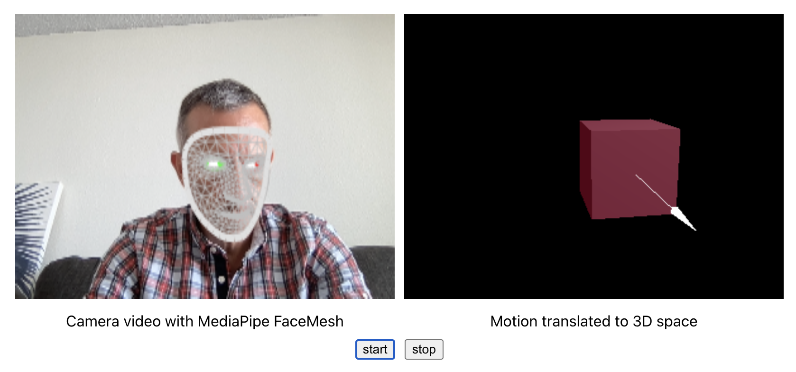
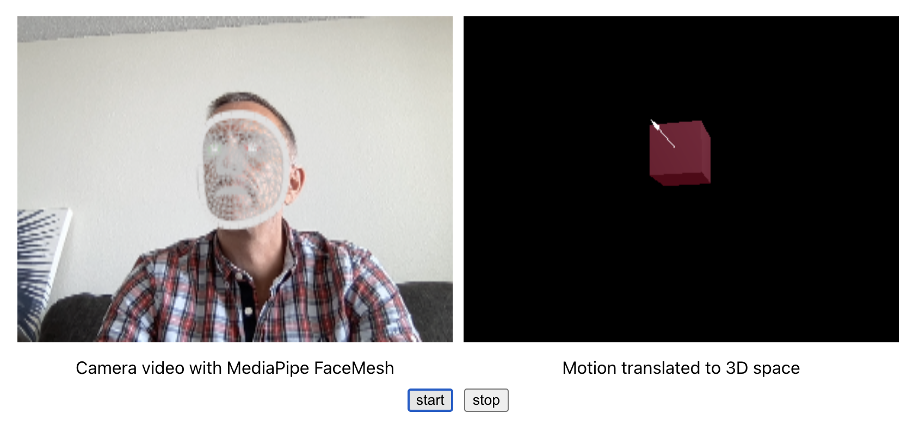
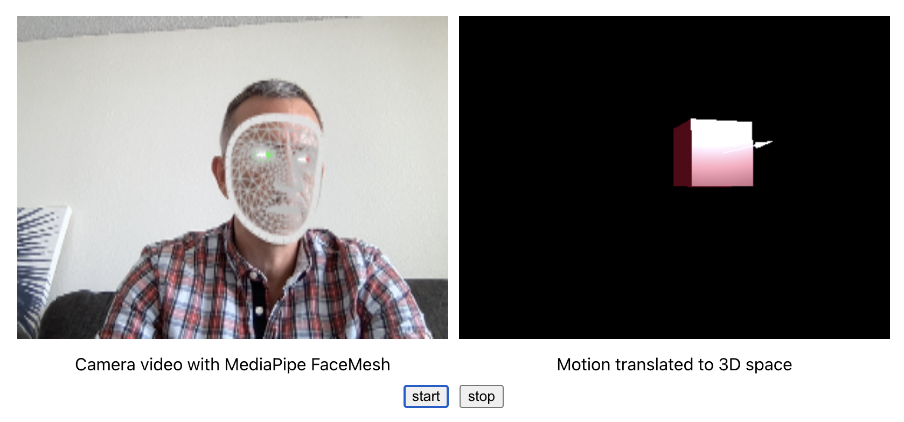

# Motion Tracking in JavaScript

This project contains some ongoing experiments with motion tracking
in JavaScript. The complete pipeline relies on several technologies:

1. MediaPipe (google.github.io/mediapipe). MediaPipe is a framework
that leverages machine learning to efficiently extract real-time motion
capture data from video streams.

1. React

1. Three.js

## Build and run locally
```
npm install
npm start
```    

To initiate motion capture and rendering click the `start` button.
You will then be asked to confirm access to the default camera connected
to you camera.

## Test
```
npm test *
```

## Screen Captures





